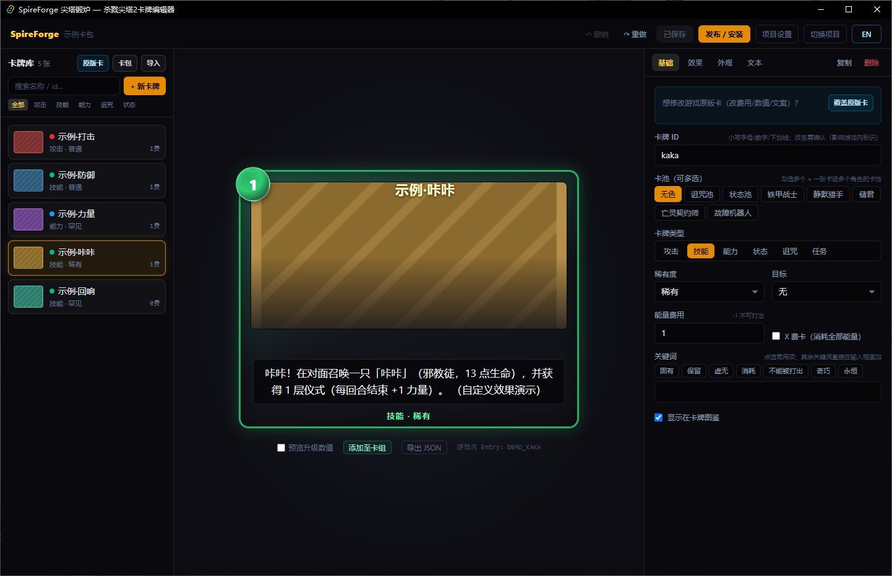

# SpireForge 尖塔锻炉

> 《杀戮尖塔 2》现代化卡牌编辑器 — 独立 GUI 建卡、实时预览、一键打包安装、Steam 工坊发布

中文 | [English](README_EN.md)

 



## 下载使用

到 [Releases](../../releases) 下载最新 `SpireForge-*-win64.zip`，解压后：

1. 双击 `editor.exe`（单文件，前端已内嵌；需要 WebView2 Runtime，Win10/11 一般自带）；
2. 首次启动选择游戏根目录（欢迎页会自动检测）；
3. **把包内 `SpireForgeRuntime` 文件夹整个复制到游戏的 `mods` 目录**（前置 mod，一次性）；
4. 建卡包 → 建卡 / 导入原版卡改卡 → 「发布 / 安装」→ 一键安装到游戏 → 重启游戏。

## 快速开始（从源码构建）

```bash
# 1. 构建并启动编辑器
cd editor && pnpm install && pnpm tauri dev

# 2. 首次使用
#    - 欢迎页自动检测游戏目录（失败则手动选择游戏根目录）
#    - 新建卡包项目 → 建卡 → 「发布 / 安装」→ 一键安装到游戏

# 3. 安装 Runtime（卡包的前置依赖，一次性）
cd runtime && dotnet build -c Release
#    把 .godot/mono/temp/bin/Release/SpireForgeRuntime.dll + SpireForgeRuntime.json
#    复制到 <游戏>/mods/SpireForgeRuntime/
```

## 特性

- **现代化深色 UI**（Tauri 2 + React + Tailwind）——独立桌面应用，不依赖游戏运行
- **全类型卡牌**：攻击 / 技能 / 能力 / 诅咒 / 状态 / 任务
- **自定义费用**：含 X 费、0 费、-1（不可打出）
- **游戏内置效果**：造成伤害、获得格挡、抽牌、获得能量、回复生命（数据驱动，可持续扩展）
- **动画特效与音效**：打出伤害自带攻击编排（前扑动画 + 打击特效 + 音效），另有「播放特效」；
  特效/音效目录标注原版出处（哪张卡、哪只怪在用），可直接按怪名/卡名搜索
- **进阶效果**：召唤敌人（自动落位）、生成卡牌、延迟效果（可选我方/敌方/双方回合触发）等
- **修改原版卡牌**：内置 577 张原版卡目录，一键导入为覆盖卡——改费用/数值/文案/行为
- **生命周期钩子**：抽到时 / 被弃时 / 被消耗时 / 战斗开始时 / 回合末在手——复用同一效果系统
- **自定义效果接口**：`custom` 效果 + `SfEffects` 注册表，其他 mod 引用 Runtime.dll 即可扩展任意行为
- **批量导入**：多卡 JSON 容器整批导入；`.pck` 卡包直读（其他 SpireForge 用户的卡包可解包再编辑）
- **第三方角色卡池**：从游戏读取、导入角色配置 JSON 或手动添加，将新卡放入其他角色 Mod 的卡池（专属机制需额外适配）
- **自定义贴图**：PNG/JPEG/WebP 上传，官方 250×190 规格提示
- **中英双语**：占位符 `{Damage}`、BBCode 着色、升级数值对照
- **一键安装**：编辑器内打包 PCK 并写入游戏 mods 目录
- **零编译卡包**：用户产出纯数据（JSON+PNG），游戏更新只需更新 Runtime
- **一键上工坊**：官方 ModUploader v0.2.0 内置（首次使用自动释放，无需单独下载）

## 目录

| 目录 | 说明 |
|---|---|
| `editor/` | Tauri 2 编辑器（React+TS 前端 / Rust 后端） |
| `runtime/` | 游戏内解释器 mod（C#/.NET 9），解释卡包 JSON 动态建卡 |
| `docs/` | **六份交接文档**（先读 [HANDOVER.md](docs/HANDOVER.md)） |
| `tools/` | pcktool（PCK 打包 CLI）、publish-test（打包逻辑测试）、反编译源码、测试素材 |

## 文档索引

- [HANDOVER.md](docs/HANDOVER.md) — 项目现状、五分钟上手、路线图、踩坑记录
- [ARCHITECTURE.md](docs/ARCHITECTURE.md) — 四组件架构、注册时序、PCK 格式
- [SCHEMA.md](docs/SCHEMA.md) — 卡牌 JSON 逐字段说明
- [CUSTOM-POOLS.md](docs/CUSTOM-POOLS.md) — 第三方角色卡池导入、依赖与兼容边界
- [RUNTIME-MOD.md](docs/RUNTIME-MOD.md) — Runtime 设计 + 游戏版本升级适配流程
- [BUILD.md](docs/BUILD.md) — 环境要求、构建、测试矩阵

## 工作原理

```
编辑器（建卡） → 卡包 = mods/<Id>/<Id>.json + <Id>.pck（JSON+PNG+本地化）
                      ↓ 游戏内置加载器挂载
Runtime mod 扫描卡包 JSON → Reflection.Emit 每卡一个类型 → 注册进 ModelDb+卡池
                      ↓ 游戏中打出
OnPlay 按效果清单 await 游戏 Cmd API 执行
```

**实现效果**：游戏识别卡牌依赖"类型名→ModelId"派生，Runtime 用动态类型
为数据生成类型；游戏 API 升级时只需更新 Runtime，已发布的卡包不受影响。

## 许可与致谢

本项目以 [MIT](LICENSE) 许可开源（免费，仅限非商业用途地使用其中的 Spire Codex 派生内容——
详见 [THIRD-PARTY-NOTICES.md](THIRD-PARTY-NOTICES.md)）。
本项目为社区工具，与 Mega Crit 无关。游戏资产版权归 Mega Crit 所有。
内嵌的 ModUploader 来自 [MegaCrit/sts2-mod-uploader](https://github.com/Megacrit/sts2-mod-uploader)（MIT）。
原版卡目录、力量/怪物目录与图标数据来自 [spire-codex](https://github.com/ptrlrd/spire-codex)
（PolyForm Noncommercial，Required Notice 见第三方声明）。
调研受益于 BaseLib（Alchyr）、RitsuLib（BAKAOLC）、fresh-milkshake/Modding-Tutorial 等社区项目。
